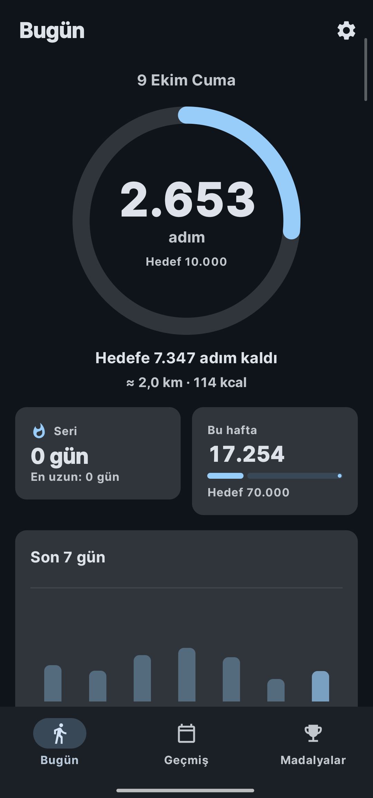
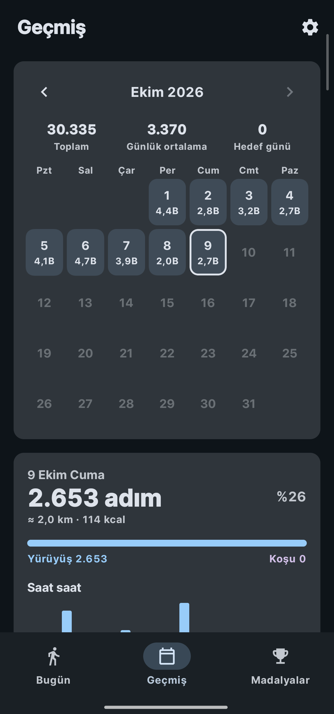
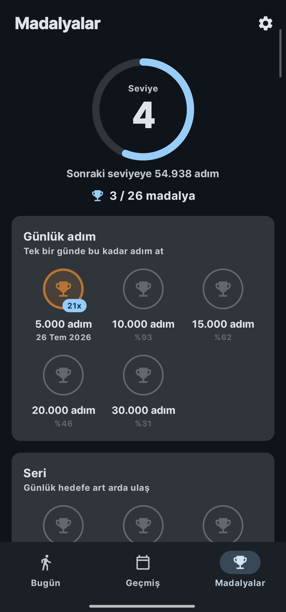
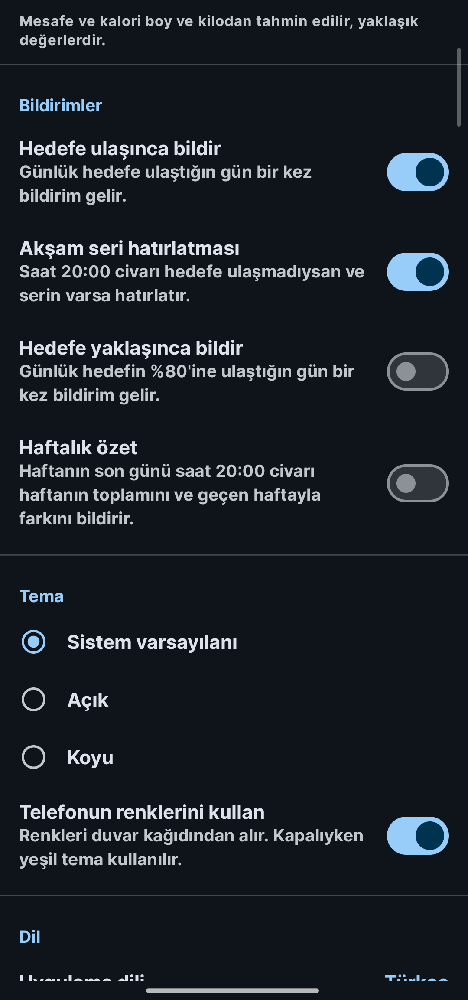
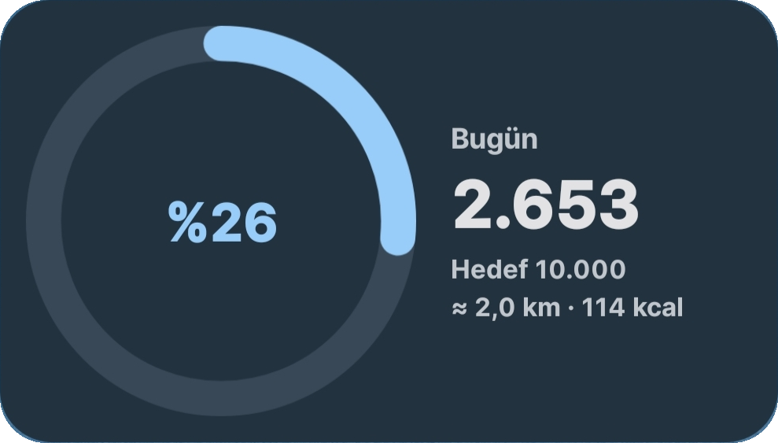
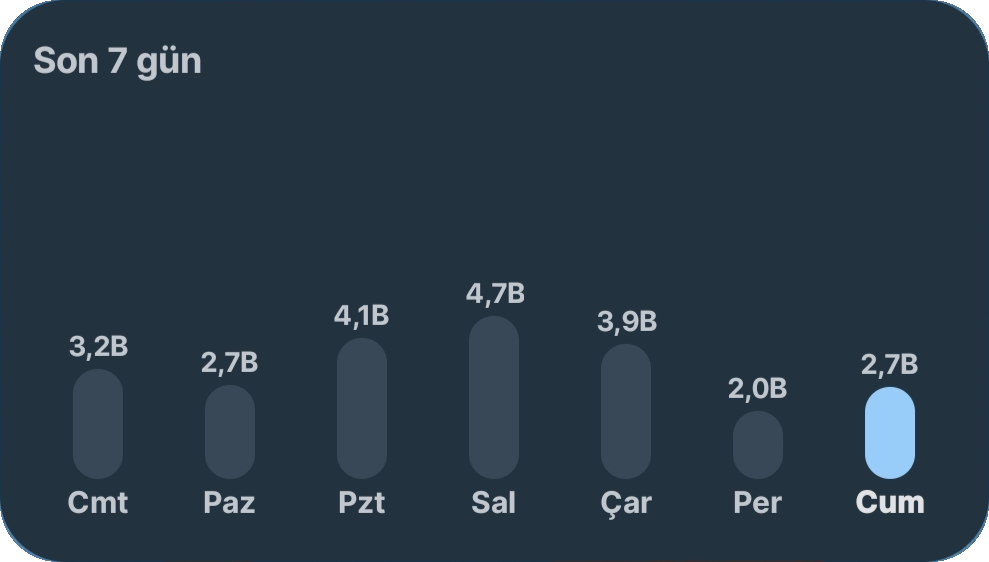
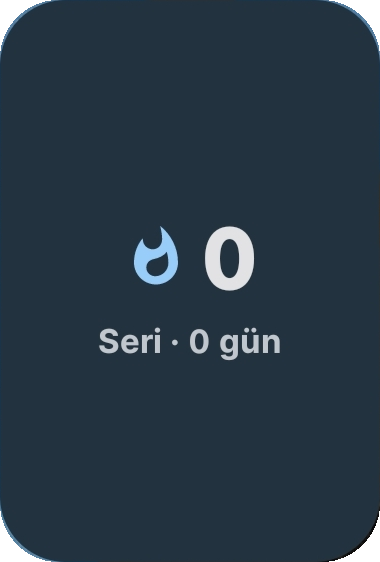
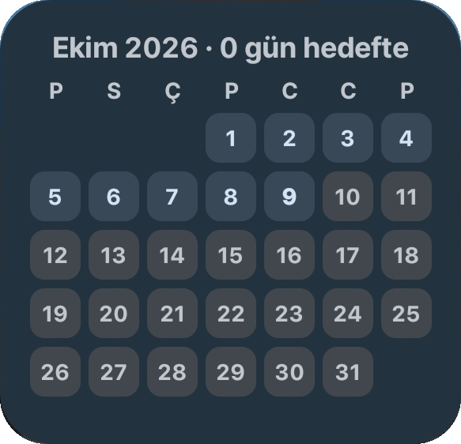

# AdımSayar

Android için reklamsız, hesapsız adım sayar. Adımlar yalnızca telefonun kendi sensörlerinden (Xiaomi'de isteğe bağlı olarak HyperOS'un kendi adım kaydından) okunur ve tüm veriler telefonda kalır.

Kişisel kullanım için, sistemde adım uygulaması olmayan bir Redmi Note 12 Pro 4G (HyperOS) için yazıldı; tüm Android telefonlarda çalışacak şekilde tasarlandı.

- Kotlin, Jetpack Compose, Material 3
- Glance ile ana ekran widget'ları
- Room ile cihazda kalıcı kayıt
- minSdk 23 (Android 6.0), targetSdk 36
- Hesap yok, sunucu yok, analitik veya reklam SDK'sı yok; internet yalnızca Ayarlar'dan elle güncelleme kontrolü için

## Ekran görüntüleri

| Bugün | Geçmiş | Madalyalar | Ayarlar |
|---|---|---|---|
|  |  |  |  |

| Bugün widget'ı | 7 günlük tablo |
|---|---|
|  |  |

| Seri ve hafta | Aylık takvim |
|---|---|
|  |  |

## Özellikler

### Bugün

- Günlük hedefe göre ilerleme halkası, kalan adım sayısı
- Mesafe ve kalori tahmini (boy ve kilodan, km veya mil)
- Seri (günlük hedefe art arda ulaşılan gün sayısı) ve bu haftanın ilerlemesi
- Son 7 günün tablosu

### Geçmiş

- Aylık takvim; her gün hedefe göre renklenir, ay ay gezilir
- Seçilen günün saat saat dağılımı ve yürüyüş/koşu ayrımı (HyperOS kaydı açıkken)
- Rekorlar: en iyi gün, en iyi hafta, en iyi ay, en uzun seri, hedefe ulaşılan gün sayısı, aktif gün ortalaması
- Yıllık özet: toplam, günlük ortalama, hedef günleri, en iyi ay ve gün, kazanılan madalyalar

### Madalyalar ve seviye

- Beş madalya grubu: günlük adım (5.000 – 30.000), seri (3 – 100 gün), haftalık hedef (1 – 52 hafta), toplam yol (100 bin – 10 milyon adım), erken kalkan (08:00'den önce 1.000 adım; HyperOS kaydı açıkken)
- Her madalyanın kaç kez kazanıldığı (ör. `5x`)
- Toplam adıma göre seviye

Madalyalar ve seviyeler hiçbir yerde saklanmaz, her açılışta günlük toplamlardan yeniden hesaplanır. Hedefi değiştirirsen geçmiş günler de yeni hedefe göre değerlendirilir.

### Widget'lar

Dört widget var. Hepsi uygulamayla aynı günlük kayıttan okur, kendi sensör okumaları yoktur.

1. **Bugünün adımı** – hedef halkasıyla bugünkü adım; boyutuna göre sadeleşir veya ayrıntı ekler
2. **7 günlük tablo** – son 7 günün adımları
3. **Seri ve hafta** – günlük hedef serisi ve haftalık ilerleme
4. **Aylık takvim** – bu ayın günleri, hedefe göre renkli

Widget'lar telefonun duvar kağıdı renklerini (Material You) veya uygulamanın temasını kullanır.

### Bildirimler (hepsi isteğe bağlı, varsayılan kapalı)

- Günlük hedefe ulaşınca
- Hedefin %80'ine yaklaşınca
- Akşam seri hatırlatması (saat 20:00 civarı, hedefe ulaşılmadıysa)
- Haftalık özet (haftanın son günü akşamı, geçen haftayla fark)

### Ayarlar

- Günlük ve haftalık hedef
- Hafta başlangıcı (pazartesi veya pazar)
- Boy, kilo, mesafe birimi
- Açık, koyu veya sistem teması; telefonun renklerini kullanma
- 12 dil: Türkçe, İngilizce, Almanca, İspanyolca, Fransızca, İtalyanca, Portekizce, Rusça, Arapça (sağdan sola), Japonca, Çince, Korece
- CSV dışa/içe aktarma (`tarih,adim`); içe aktarırken her gün için yüksek olan sayı kalır
- Güncelleme kontrolü (GitHub'daki son sürümle karşılaştırır, yeni sürüm varsa indirme sayfasını açar) ve GitHub sayfası bağlantısı
- Adım kaynağı anahtarları, okuma kaydı ve sürüm notları

## Adım verisi nasıl alınıyor

Uygulamanın tek gerçek verisi **gün başına toplam adım**dır (`daily_steps` tablosu: tarih, adım). Diğer her şey bundan türetilir. Bu tabloya veri üç yoldan gelebilir.

### 1. Telefonun adım sayacı sensörü (`TYPE_STEP_COUNTER`) – varsayılan yol

Android'in adım sayacı, telefon açıldığından beri atılan toplam adımı veren bir donanım sayacıdır. Uygulama bu sayacı okur ve iki okuma arasındaki farkı adım olarak kaydeder:

1. İlk okumada yalnızca başlangıç değeri alınır; adımlar bu andan sonra sayılır.
2. Her yeni okumada önceki okumayla fark hesaplanır (`StepMath.interval`).
3. Bu fark iki okumanın saatleri arasında günlere bölünür (`StepMath.splitByDay`); gece yarısını geçen bir aralık iki güne orantılı dağıtılır.
4. Günlük toplamlara eklenir.

Okumaları güvenilir kılan kontroller:

- **Yeniden başlatma:** telefon yeniden açılınca sayaç sıfırlanır. Bu, `Settings.Global.BOOT_COUNT` değişiminden anlaşılır; o durumda sayacın yeni değeri açılıştan sonraki adım olarak eklenir.
- **Geç gelen eski okumalar:** donanım olayları toplu teslim edebildiği için eski bir değer yeni bir değerden sonra gelebilir. Okumalar olayın kendi zaman damgasıyla sıralanır; eski olanlar yok sayılır.
- **Sayaç sıfırlanması:** aynı açılışta sayaç geriye giderse yeni değer adım olarak eklenir, negatif adım yazılmaz.

Sensör şu anlarda okunur:

| Ne zaman | Nasıl |
|---|---|
| Uygulama ekrandayken | Canlı dinleyici, adımlar anında görünür |
| Her 15 dakikada bir | `JobScheduler` işi sayacı bir kez okur ve widget'ları yeniler |
| Tam gece yarısı | `AlarmManager` ile gün dönümü, widget'lar yeni güne geçer |
| Açılış, saat veya saat dilimi değişimi, güncelleme | Sistem olayı alıcısı zamanlamaları yeniden kurar ve sayacı okur |
| "Arka planda sürekli say" açıksa | Ön plan servisi sayacı sürekli kayıtlı tutar (aşağıda) |

### 2. "Arka planda sürekli say" (isteğe bağlı ön plan servisi)

Bazı telefonlarda adım sayacı yalnızca bir uygulama onu dinlerken ilerler. Uygulama kapatılınca (örneğin HyperOS son uygulamalardan kaydırınca uygulamayı tamamen öldürür) o sırada atılan adımlar hiçbir yerden okunamaz.

Bu anahtar açılırsa küçük, sessiz, kalıcı bir bildirimle bir ön plan servisi çalışır ve sayacı sürekli kayıtlı tutar. Pil için olaylar donanımda biriktirilip 60 saniyede bir toplu teslim edilir (`maxReportLatency`), böylece işlemci her adımda uyandırılmaz. Bildirim bugünkü adımı gösterir.

Varsayılan olarak kapalıdır. Bildirimsiz yol yeterli olan telefonlarda gerekmez.

### 3. Xiaomi / HyperOS adım kaydı (isteğe bağlı, yalnızca Xiaomi)

HyperOS (ve MIUI) adımları kendi sistem servisiyle sürekli kaydeder; uygulama açık olsun olmasın. Bu kayıt `content://com.miui.providers.steps/item` adresinden, `miui.permission.READ_STEPS` izniyle (normal izin, kurulumda otomatik verilir) okunabilir. Her satır bir zaman aralığı ve o aralıktaki adım sayısıdır (`_begin_time`, `_end_time`, `_steps`, `_mode`).

Ayarlar'daki **"HyperOS adım kaydını kullan"** anahtarı yalnızca üretici Xiaomi ise ve kayıt okunabiliyorsa görünür. Açıldığında:

- Günlük toplamlar sensörden değil, bu kayıttan hesaplanır; telefonda geçmişte kaydedilmiş günler de içe alınır.
- Uygulama kapalıyken atılan adımlar da eksiksiz gelir, bildirim gerekmez; ön plan servisi kapatılır.
- Saat saat dağılım ve yürüyüş/koşu ayrımı (`_mode`: 2 yürüyüş, 3 koşu) bu kayıttan gelir. Erken kalkan madalyası da yalnızca bu kayıtla hesaplanabilir.
- Kayıt okunamazsa veya telefonun sensörü adım görürken kayıt on dakika boyunca ilerlemezse uyarı kartı çıkar ve anahtar kapatılıp sensör yoluna dönülebilir.

Bu yol yalnızca üretici tespitiyle (`Build.MANUFACTURER`) ve kullanıcı açıkça seçtiğinde kullanılır.

### Donma kontrolü

`TYPE_STEP_COUNTER` bazı telefonlarda (özellikle Samsung'da raporlanmış) saymayı durdurabiliyor. Uygulama ekrandayken adım dedektörü (`TYPE_STEP_DETECTOR`) da dinlenir. Son iki dakikada dedektör en az 50 adım görmüş ama sayaç hiç ilerlememişse sayaç donmuş sayılır: kullanıcıya uyarı gösterilir ve sensöre yeniden bağlanılır. Telefonu yeniden başlatmak gerekmez.

### Kullanılmayanlar

- **Health Connect kullanılmaz.** Telefon ve saat verisini birleştirdiği için saat takılıyken adımlar iki kez yazılabiliyor ve aynı gün için iki farklı toplam çıkabiliyor. Gerekçe: [GOALS.md](GOALS.md).
- Sensör hiç yoksa (bazı telefonlar adım sayacı bildirdiği halde vermiyor) uygulama çökmez, açıklayıcı bir mesaj gösterir.

## Pil ve arka plan

Xiaomi, Huawei, Oppo, Vivo, Samsung gibi markalar arka plandaki uygulamaları agresif biçimde kapatabiliyor. Uygulama pil optimizasyonu muafiyetini zorla istemez. Bunun yerine, marka agresifse ve muafiyet verilmemişse, o markaya özel adımları ve ilgili ayar ekranına kısayolu gösteren kapatılabilir bir yardım kartı gösterir. Muafiyet verildiğinde kart kendiliğinden kaybolur.

## Gizlilik

- Uygulama adım verisini hiçbir yere göndermez. İnterneti tek bir iş için kullanır: Ayarlar'da "Güncellemeleri kontrol et"e dokunduğunda GitHub'dan son sürümün numarasını okur (`api.github.com/repos/DorDeorz/adimsayar/releases/latest`). Bu istek yalnızca sen dokunduğunda yapılır, arka planda çalışmaz ve istekle hiçbir veri gönderilmez.
- Hesap, sunucu, senkronizasyon, analitik ve reklam yoktur.
- Veri kaybına karşı Android'in kendi yedeklemesi (`allowBackup`) ve kullanıcının kendi eliyle yaptığı CSV dışa aktarma kullanılır.

İstenen izinler:

| İzin | Neden |
|---|---|
| `ACTIVITY_RECOGNITION` | Adım sensörlerini okumak (Android 10+) |
| `miui.permission.READ_STEPS` | Xiaomi'de HyperOS adım kaydını okumak |
| `FOREGROUND_SERVICE`, `FOREGROUND_SERVICE_HEALTH` | İsteğe bağlı "Arka planda sürekli say" |
| `POST_NOTIFICATIONS` | Servis bildirimi ve isteğe bağlı hedef bildirimleri |
| `RECEIVE_BOOT_COMPLETED` | Telefon açılınca zamanlamaları yeniden kurmak |
| `SCHEDULE_EXACT_ALARM` | Gün dönümünü tam gece yarısı yapmak |
| `INTERNET` | Yalnızca elle başlatılan güncelleme kontrolü |

## Kurulum

En kolay yol: [Releases](../../releases/latest) sayfasından son sürümün APK'sını indirip telefona kurmak. Sonraki sürümleri Ayarlar → "Güncellemeleri kontrol et" ile görebilirsin.

Her derlemenin APK'sı ayrıca [Actions](../../actions) sekmesinde, çalıştırmanın `adimsayar-apk-ve-raporlar` çıktısında bulunur.

Release APK, depoda bulunmayan ve GitHub Actions Secret'larında saklanan bir anahtarla imzalanır (`ADIMSAYAR_KEYSTORE_BASE64`, `ADIMSAYAR_KEYSTORE_PASSWORD`). Bu Secret'lar olmadan (örneğin bir fork'ta) APK geçici bir debug anahtarıyla imzalanır.

İlk açılışta "Fiziksel etkinlik" izni verilmelidir. Xiaomi telefonlarda Ayarlar → Adım kaynağı → "HyperOS adım kaydını kullan" açılması önerilir.

### Yeni sürüm yayınlama

1. `app/build.gradle.kts` içinde `versionName` ve `versionCode` artırılır ve `main`'e birleştirilir.
2. `versionName` ile aynı adda bir etiketle sürüm yayınlanır, örneğin `v0.6.1`. İki yoldan biri:
   - GitHub'da Releases → "Draft a new release" → etiket `v0.6.1` → "Publish release"
   - ya da komut satırından: `git tag v0.6.1 && git push origin v0.6.1`
3. GitHub Actions APK'yı derler, imzalar ve `adimsayar-0.6.1.apk` olarak Release'e ekler. Etiket `versionName` ile uyuşmazsa iş durur.

### Kaynaktan derleme

Android SDK ve JDK 21 gerekir:

```
./gradlew assembleDebug
```

Testler:

```
./gradlew testDebugUnitTest
```

## Proje yapısı

```
app/src/main/java/com/dordeorz/adimsayar/
├── MainActivity.kt          izin, canlı sayaç, ekranlar
├── sensor/                  sensör okuma, canlı dinleyici, donma kontrolü
├── data/                    Room veritabanı, adım hesabı, HyperOS kaydı, madalyalar, ayarlar
├── background/              15 dk işi, gece yarısı alarmı, ön plan servisi, bildirimler
├── widget/                  dört Glance widget'ı
└── ui/                      Compose ekranları, tema, marka bazlı pil yardımı
```

Tasarım kararları ve ölçüm planı: [GOALS.md](GOALS.md). Geliştirme kuralları: [CLAUDE.md](CLAUDE.md).

## Sürüm geçmişi

Her sürümde nelerin eklendiği ve nelerin düzeltildiği, yeniden eskiye. Uygulama içinde de Ayarlar → Sürüm notları altında görülebilir.

### 0.6.1

Eklenenler
- Ayarlar'da "Güncellemeleri kontrol et": GitHub'daki son sürümle karşılaştırır, yeni sürüm varsa indirme sayfasını açar. Yalnızca dokununca çalışır, arka planda kontrol yapılmaz.
- Ayarlar'da GitHub sayfası bağlantısı (kaynak kod, sürümler, hata bildirimi).
- Henüz yayınlanmış sürüm yoksa güncelleme kontrolü bunu ayrıca söyler.

Depo ve derleme
- İmza anahtarı depodan çıkarıldı; APK artık GitHub Secret'larında saklanan yeni bir anahtarla imzalanıyor. Bu sürüme geçerken uygulamayı bir kez kaldırıp kurmak gerekir (önce CSV dışa aktar).
- `v*` etiketi gönderilince APK otomatik derlenip GitHub Releases'te yayınlanıyor.
- Açık kaynak README, ekran görüntüleri ve MIT lisansı.

### 0.6.0

Eklenenler
- Haftalık özet bildirimi: haftanın son günü akşamı haftanın toplamı ve geçen haftayla fark.
- Hedefe yaklaşınca bildirim (günlük hedefin %80'i).
- Geçmiş'te yıllık özet: toplam, günlük ortalama, hedef günleri, en iyi ay ve gün, kazanılan madalyalar.

### 0.5.0

Eklenenler
- Madalyalarda kaç kez kazanıldığı (ör. `5x`).
- Widget'lar telefonun renklerini (Material You) veya uygulamanın temasını kullanıyor.
- Widget'lar boyutlarına göre düzenleniyor: küçültülünce sadeleşir, büyütülünce ayrıntı ekler.
- Yeni widget'lar: Seri ve hafta, Aylık takvim.
- 10 yeni dil: Almanca, İspanyolca, Fransızca, İtalyanca, Portekizce, Rusça, Arapça, Japonca, Çince, Korece.

Düzeltilenler
- Arapçada sağdan sola düzen, Latin rakamlar, her dilde yerel tarih sırası ve birimler.

### 0.4.0

Eklenenler
- Bugün widget'ında hedef halkası.
- Erken kalkan madalyası (08:00'den önce 1.000 adım; HyperOS kaydı açıkken).
- İngilizce dil seçeneği.

Düzeltilenler
- Üst çubuk durum çubuğunun altına alındı; Geçmiş'te ay değişince seçili gün o aya taşınıyor.
- 15 dakikalık arka plan okuması, widget'ların kullandığı WorkManager ile aynı iş numarasını aldığı için hiç çalışmıyordu; ayrı numaraya taşındı.

### 0.3.0

Eklenenler
- Boy ve kilodan mesafe ve kalori tahmini (km veya mil).
- Geçmiş'te seçilen günün saat saat dağılımı ve yürüyüş/koşu ayrımı (HyperOS kaydı açıkken).
- En iyi ay rekoru, hafta başlangıcı seçimi (pazartesi veya pazar).
- İsteğe bağlı bildirimler: hedefe ulaşınca, akşam seri hatırlatması.
- CSV ile dışa ve içe aktarma.

Düzeltilenler
- HyperOS uyarı kartı çıkınca kaynak anahtarı da uyarının altında gösteriliyor.
- Seri hesabında bugünden önceki eksik gün doğru sayılıyor.

### 0.2.0

Eklenenler
- Yeni tasarım: alt menüde Bugün, Geçmiş ve Madalyalar.
- Bugün ekranında hedef halkası, seri ve haftalık ilerleme.
- Geçmiş: aylık takvim, gün ayrıntısı ve kişisel rekorlar.
- Madalyalar ve seviye: günlük adım, seri, haftalık hedef, toplam yol.
- Ayarlanabilir günlük ve haftalık hedef; widget da yeni hedefi gösteriyor.
- Ayarlar: açık, koyu veya sistem teması, telefonun renkleri, adım kaynağı anahtarları ve okuma kaydı.

### 0.1.0

Eklenenler
- İlk sürüm: adım sensöründen okuma, günlük kayıt, Bugün ve 7 günlük tablo widget'ları.
- "Arka planda sürekli say" seçeneği ve marka bazlı pil yardım kartı.
- Xiaomi'de HyperOS adım kaydından okuma; geçmiş günler de içe alınıyor.
- HyperOS kaydı okunamazsa veya ilerlemezse uyarı kartı.

Düzeltilenler
- Arka plan servisinin 60 saniyede bir toplu gelen eski sayaç değerleri, yeni değerlerden sonra gelince adımlar şişiyordu (50 adım 424 görünüyordu). Okumalar artık olay zaman damgasıyla sıralanıyor, telefonun yeniden başlatılması açılış sayacından anlaşılıyor.
- CI derlemeleri sabit bir anahtarla imzalandı ki yeni sürüm eskisinin üstüne kurulabilsin.

## Geliştirme

Bu proje [Claude Code](https://claude.com/claude-code) ile geliştirilmektedir. Kardeş proje: [Kronometre](https://github.com/DorDeorz/kronometre).

## Lisans

[MIT](LICENSE). Kodu kullanabilir, değiştirebilir ve dağıtabilirsin; telif ve lisans metninin korunması yeterli.

---

### English

AdımSayar is a private Android step counter: no account, no server, no ads or analytics; the network is used only for a manual update check against GitHub Releases. Steps come from the phone's own `TYPE_STEP_COUNTER` sensor (with an optional foreground service for ROMs that stop the counter when the app is killed), or on Xiaomi phones optionally from HyperOS's own step record (`content://com.miui.providers.steps/item`). Daily totals are the only stored data; medals, levels, streaks and records are derived on the fly. Health Connect is intentionally not used. The UI is available in 12 languages. Licensed under MIT.
